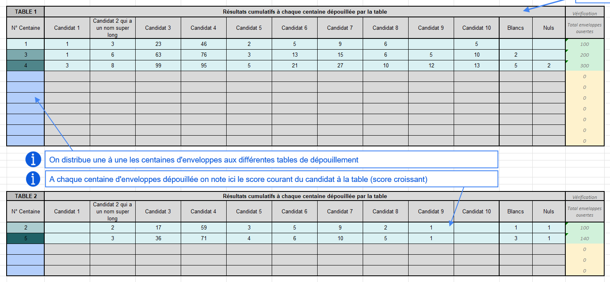
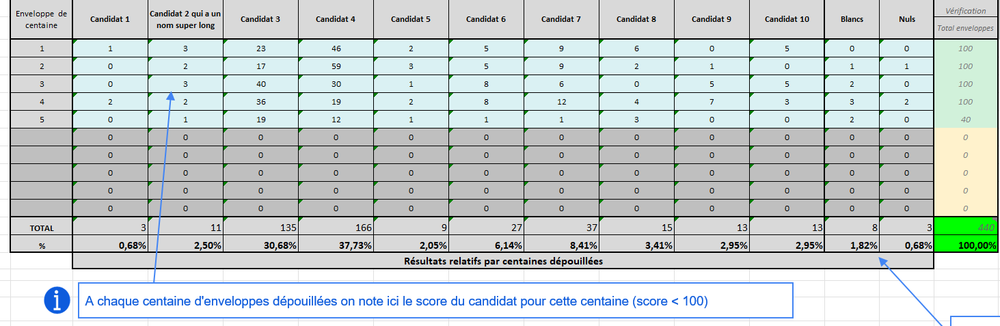

# 🗳️ Tableur de Suivi des élections

Ce classeur Excel (avec macros) est conçu pour **organiser, suivre et centraliser les résultats d'une élection municipale à Cogolin (Var)**, bureau par bureau. Il facilite le **dépouillement, la saisie, l’analyse des résultats** et le **suivi de la participation horaire**.

## 📁 Fichiers

**Tableur de suivi :** [`Elections Cogolin.xlsm`](./Elections%20Cogolin.xlsm)

**Feuille de dépouillement :** 
 - [`Mode relatif`](./Feuille_depouillement%20relatif.xlsx)
 - [`Mode absolu`](./Feuille_depouillement%20absolu.xlsx)

---

## 🔧 Fonctionnalités principales

- **Feuille "Synthèse"** :
  - Agrégation automatique des résultats de tous les bureaux
  - Calculs de participation, taux d’abstention, votes exprimés
  - Vérifications des totaux
    
    
    
- **Feuilles par bureau** (`Bureau 1`, `Bureau 2`, ..., `Bureau 12`) pour saisir :
  - Le suivi de la participation heure par heure
  - Le dépouillement des bulletins
    
  

- **Feuille "Participation horaire"** :
  - Suivi de la participation par tranche horaire dans chaque bureau
  - Calcul des pourcentages de participation cumulée
  - Comparaison possible avec le tour précdent
    
    
    
- **Macros intégrées facultatives** (nécessite l’activation) Automatisations pour l'instanciation initiale du fichier :
  - Générer les 12 bureaux sur le modèle de `Bureau 0`
  - Répliquer la couleur des candidats dans tous les graphiques
  - Importer les données de participation horaire du premier tour

---

## 🔒 Protection des feuilles

L'utilisateur __ne peut et ne doit__ modifier que les cases 🟦 **bleu clair** 🟦. Toutes les cases ⬜ **gris clair** ⬜ sont calculées automatiquement. Si vous voulez adapter le fichier, le mot de passe de protection de chaque feuille est `toto`.

---

## 💻 Pré-requis bureautique

Le tableur est conçu pour que chaque bureau de vote ouvre ce même fichier et y contribue en direct. Il faut donc disposer d'une solution informatique (postes de travail, licences Excel et réseau) compatible avec cette utilisation. A défaut, il faudrait recourir à un autre moyen de communication classique (téléphone, sms) et l'intêret du tableur resterait limité au bureau centralisateur pour les calculs automatiques.

## 🧑‍💻 Utilisation

0. **Activer les macros** à l’ouverture du fichier Excel. *Utile mais pas nécessaire pour l'utilisation*.
1. Pour le **bureau centralisateur**, avant le début du scrutin:
   - Ouvrir l'onglet *Synthèse*
   - Renseigner les données de l'élection (noms des bureaux, nombre d'inscrits, date, élection, ville)
   - Renseigner le nom des candidats et leur couleur associée.
2. Pour **chaque bureau de vote** :
   - Ouvrir l’onglet correspondant (ex: *Bureau 5*)
   - Pendant la journée du vote, renseigner les données de **participation horaire** à droite de la feuille
   - Au dépouillement, remplir les cases avec les résultats au fur et à mesure des enveloppes de centaines de bulletins dépouillés
3. Pendant la journée, visualiser la progression de la participation dans *Participation horaire*.
4. **Suivre le dépouillement en temps réel la synthèse** dans l’onglet *Synthèse*. Toutes les données des bureaux sont centralisées dans *Synthèse*

### 🗳️ Dépouillement : deux méthodes possibles

On propose deux versions de la feuille de dépouillement à imprimer en A3 portrait pour aider les scrutateurs à compter les bulletins. Chaque table de dépouillement remplit sa feuille en deux exemplaires (deux scrutateurs par table). Chaque bureau remplit ses résultats de dépouillement dans son onglet (ex: *Bureau 5*), deux méthodes s'offrent à lui :

1. **Décompte absolu** (préféré) : On remplit le tableau **en dessous** du graphique, table par table. Les scores (absolus) des candidats sont croissants d'enveloppe (de centaine) en enveloppe et le calcul des scores par centaines (relatif) se fait automatiquement dans le tableau du haut. Ce mode évite aux scrutateurs d'avoir à faire des calculs à chaque centaine. La somme est cumulative de centaine en centaine, c'est à dire qu'on ajoute le score de la centaine précédente à celui de la centaine actuelle.

2. **Décompte relatif** : On remplit le tableau **au dessus** directement. On entre les scores qui sont relatifs à la centaine dépouillée. La somme de chaque centaine doit être égale à 100 et on repart à 0 à chaque nouvelle centaine.

---

## 📊 Exemple

L’onglet `Exemple` montre comment renseigner les données pour un bureau fictif avec des votes pour 10 candidats, ainsi que la progression horaire. Les feuilles de dépouillement d'exemple sont ausi fournies.

---

## ✅ Avantages

- Centralisation rapide et fiable des données
- Vérifications automatiques des totaux
- Aide à la transparence lors du dépouillement
- Lecture facile des résultats par tous les scrutateurs

---

## 📌 À savoir

- Ce classeur a été développé pour une élection municipale mais peut être adapté à d'autres scrutins.
- Les noms des candidats peuvent être modifiés directement dans la feuille synthèse et seront automatiquement recopiés partout.
- Les noms des bureaux de vote également.
- Ce tableur inclut une protection par mot de passe dans certaines feuilles pour éviter les erreurs de saisie (mdp par défaut = `toto`).

---

## 📄 Licence

Ce projet est sous licence **GNU General Public License v3.0** – voir le fichier [`LICENSE`](./LICENSE) pour plus d’informations.

---

## 🔮 Évolutions à venir

Des améliorations futures sont envisagées pour rendre ce tableur encore plus flexible, sécurisé et complet :

- 🔢 **Gestion dynamique du nombre de bureaux**  
  Permettre à l’utilisateur de choisir combien de bureaux seront créés.

- 👤 **Gestion dynamique du nombre de candidats**  
  Adapter automatiquement les tableaux et les graphiques en fonction du nombre de candidats saisis.

- 🔒 **Protection renforcée entre les bureaux**  
  Empêcher les agents d’un bureau de modifier les résultats d’un autre bureau (par mot de passe, ou séparation par fichier).

- 🖨️ **Export automatique d’un récapitulatif PDF**  
  Générer un document lisible et clair pour affichage en mairie ou en salle des résultats.

- 🧪 **Mode test/simulation**  
  Intégrer un mode de démonstration pour simuler des élections fictives avec des résultats aléatoires.

- 📈 **Analyse comparative avec les précédentes élections**  
  Compléter la macro permettant de comparer les taux de participation par l'ajout des résultats des scrutins passés.

Contributions et suggestions bienvenues via issues ou pull requests ! 🙂

