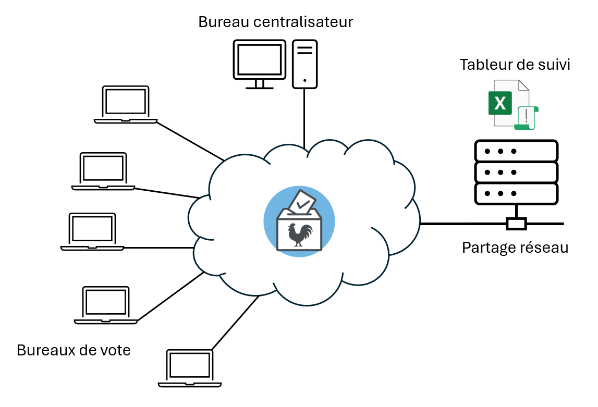

&nbsp;

# 🗳️ Tableur de Suivi des Élections Municipales à Cogolin

Ce classeur Excel (avec macros) est conçu pour **organiser, suivre et centraliser les résultats d'une élection municipale à Cogolin (Var)**, bureau par bureau. Il facilite le **dépouillement, la saisie, l’analyse des résultats** et le **suivi de la participation horaire**, et intègre désormais une **fonctionnalité de simulation réaliste des suffrages**.

---

## 📁 Fichiers

**Tableur de suivi :** [`Elections Cogolin.xlsm`](./Elections%20Cogolin.xlsm)

**Feuille de dépouillement** :
 - [`Mode relatif`](./Feuille_depouillement%20relatif.xlsx)
 - [`Mode absolu`](./Feuille_depouillement%20absolu.xlsx)

---

## 🔧 Fonctionnalités principales

- **Feuille "Synthèse"** :
  - Agrégation automatique des résultats de tous les bureaux
  - Calculs de participation, taux d’abstention, votes exprimés
  - Vérifications des totaux
- **Feuille "Projection"** :
  - Présentation en direct au public des données clés
  - Suivi en direct du taux de participation et du dépouillement
- **Feuilles par bureau** (`Bureau 1`, `Bureau 2`, ..., `Bureau 12`) pour saisir :
  - Le suivi de la participation heure par heure
  - Le dépouillement des bulletins
- **Feuille "Participation horaire"** :
  - Suivi de la participation par tranche horaire dans chaque bureau
  - Calcul des pourcentages de participation cumulée
  - Comparaison possible avec le tour précédent
- **Feuille de décompte** :
  - Permet de calculer les résultats par centaines à la main si le tableur n'est pas déployé dans chaque bureau
- **Macros intégrées** (optionnelles - nécessitent l’activation) :
  - Générer les 12 bureaux sur le modèle de `Bureau 0`
  - Répliquer la couleur des candidats dans tous les graphiques
  - Importer les données de participation horaire du premier tour
  - Simuler une journée de vote et un dépouillement réaliste :
    - Simulation de la participation horaire de chaque bureau
    - Simulation des suffrages avec répartition réaliste des voix entre candidats

---

## 🎲 Simulation des suffrages

Le bouton `Simuler dépouillement` dans l'onglet `Synthèse` permet de simuler des résultats de vote réalistes.

De même, le bouton `Simuler participation journée` dans l'onglet `Participation horaire` permet de simuler une affluence réaliste dans les bureaux de vote.

Cette fonctionnalité est idéale pour :

- Tester le bon fonctionnement du tableur avant le jour J.
- Former les équipes à prendre en main le tableur.

---

## 🔒 Protection des feuilles

L'utilisateur **ne peut et ne doit** modifier que les cases 🟦 **bleu clair** 🟦. Toutes les cases ⬜ **gris clair** ⬜ sont calculées automatiquement. Le mot de passe de protection de chaque feuille est `toto`.

---

## 💻 Pré-requis bureautique

Le tableur est conçu pour que chaque bureau de vote ouvre ce même fichier et y contribue en direct. Il faut donc disposer d'une solution informatique (postes de travail, licences Excel et réseau) compatible avec cette utilisation. A défaut, il faudrait recourir à un autre moyen de communication classique (téléphone, sms) et l'intêret du tableur resterait limité au bureau centralisateur pour les calculs automatiques.

---

## 🧑‍💻 Utilisation

⚠️ Règle d’or : **seules les cellules bleu clair sont modifiables**
🔵 Bleu clair = vous pouvez saisir des données.

0. (optionnel) **Activer les macros** à l’ouverture du fichier Excel.
1. Pour le **bureau centralisateur** et avant le début du scrutin :
  - Renseigner les données de l'élection (noms des bureaux, nombre d'inscrits, date, élection, ville).
  - Renseigner le nom des candidats et leur couleur associée.
  - Utiliser les macros (boutons) pour générer tous les bureaux et harmoniser les couleurs.
2. Placer le tableur ainsi initialisé sur un partage réseau éditable à plusieurs
3. Pour **chaque bureau de vote** et dans son onglet respectif:
  - Renseigner les données de **participation horaire** pendant la journée.
  - Remplir les résultats du dépouillement au fur et à mesure.

---

## ✅ Avantages

- Centralisation rapide et fiable des données
- Vérifications automatiques des totaux
- Aide à la transparence lors du dépouillement
- Simulation réaliste pour tester le tableur

---

## 📌 À savoir

- Ce classeur peut être adapté à d'autres scrutins.
- Les noms des candidats et des bureaux peuvent être modifiés directement dans la feuille synthèse.
- Le mot de passe par défaut pour les feuilles protégées est `toto`.

---

## 📄 Licence

Ce projet est sous licence **GNU General Public License v3.0** – voir le fichier [`LICENSE`](./LICENSE) pour plus d’informations.

---

## 🔮 Évolutions à venir

- **Protection renforcée entre les bureaux**
- **Export automatique d’un récapitulatif PDF**
- **Analyse comparative avec les précédentes élections**

Contributions et suggestions bienvenues via issues ou pull requests ! 🙂
